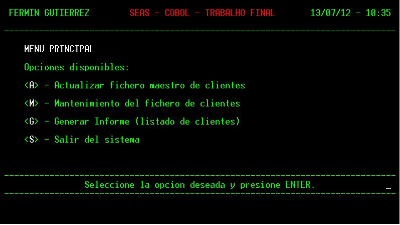
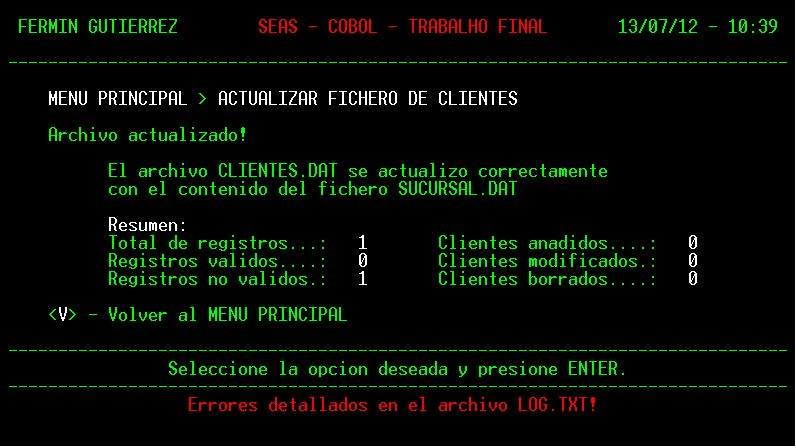
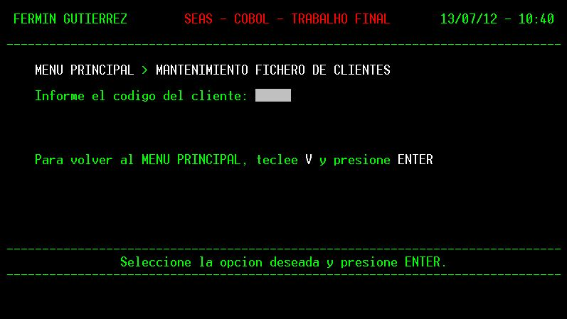
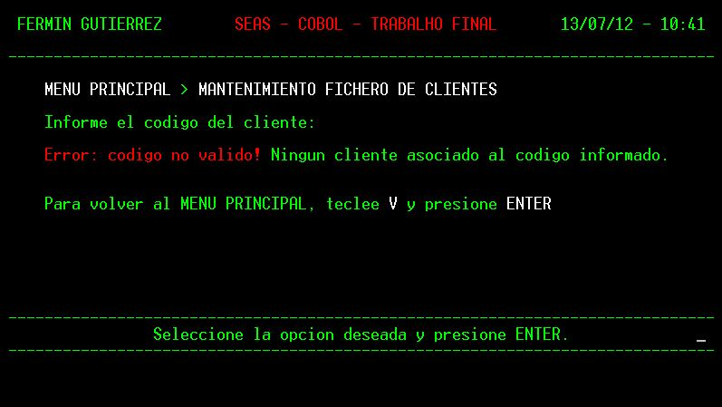
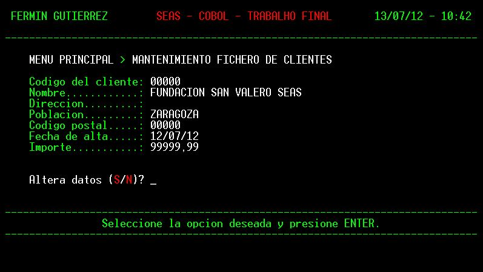
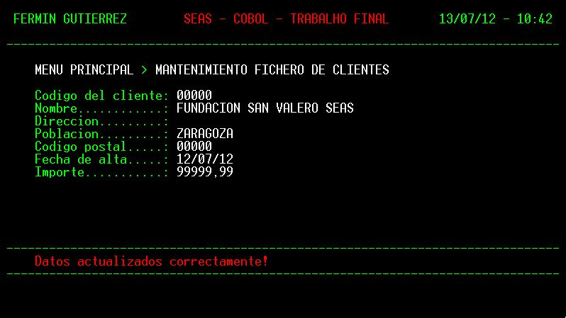
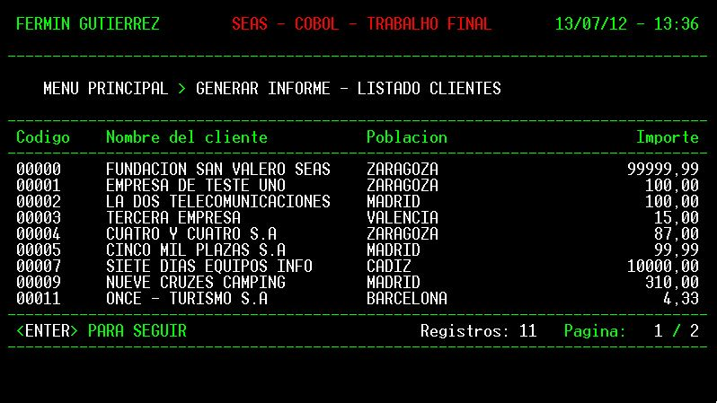
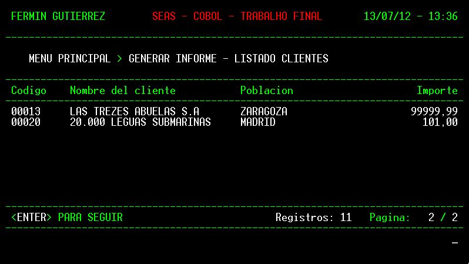
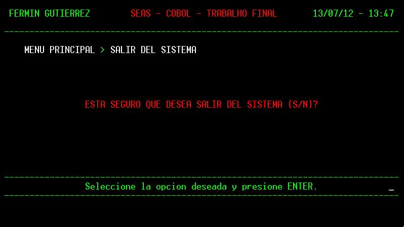

# Cobol Technician Specialist

Repositorio de estudios desarrollados como requisitos para la conclusión del Curso de Técnico Especialista en COBOL (Diploma en Cobol), impartido en español por la Fundación San Valero y la Universidad Católica Santa Teresa de Jesús de Ávila, España.
 

## Datos del Curso:

* **Alumno**: **Fermyno Gutierrez**
* **Curso**: **Diploma en Cobol**
* **Asignaturas**: [Ver programa del curso](docs/presentacion-del-curso.pdf).

# Actividades Desarrolladas

## Ejercicios

* **UNIDAD 8:**  
  **Programa:** [U8-PE-ASI10](src/U8-PE-ASI10.cbl)  
  **Descripción:** PROGRAMA QUE CREA UN ARCHIVO SECUENCIAL DE CLIENTES Y UN ARCHIVO SECUENCIAL INDEXADO DE FACTURAS.  

* **UNIDAD 9:**  
  **Programa:** [U9-PE-AS01](src/U9-PE-AS01.cbl)  
  **Descripción:** PROGRAMA QUE CREA UN ARCHIVO SECUENCIAL DE ARTICULOS VACIO.  

* **UNIDAD 9:**  
  **Programa:** [U9-PE-AS02](src/U9-PE-AS02.cbl)  
  **Descripción:** PROGRAMA QUE CREA UN ARCHIVO SECUENCIAL DE ARTICULOS VACIO.  

* **UNIDAD 9:**  
  **Programa:** [U9-PE-AS03](src/U9-PE-AS03.cbl)  
  **Descripción:** ESTE PROGRAMA LEE LA INFORMACION DE LOS ARCHIVOS SECUENCIALES DE ARTICULOS Y DE TIPOS DE ARTICULOS Y MUESTRA SU INFORMACION POR PANTALLA LEE LOS ARCHIVOS ATPAR.SEC Y AARTI.SEC

* **UNIDAD 9:**  
  **Programa:** [U9-PE-AS04](src/U9-PE-AS04.cbl)  
  **Descripción:** ESTE PROGRAMA LEE LA INFORMACION DEL ARCHIVO SECUENCIAL DE ARTICULOS Y INCREMENTA EN UN 10% EN LOS PRECIOS.  

* **UNIDAD 9:**  
  **Programa:** [U9-PE-AS05](src/U9-PE-AS05.cbl)  
  **Descripción:** ESTE PROGRAMA LEE LA INFORMACION DEL ARCHIVO SECUENCIAL DE ARTICULOS Y ELIMINA LOS ARTICULOS DE DEPORTES. 
  EN REALIDAD GRABA SOLAMENTE LOS REGISTROS REQUERIDOS EN UN NUEVO ARCHIVO.  

* **UNIDAD 10:**  
  **Programa:** [U10-PE-ASI01](src/U10-PE-ASI01.cbl)  
  **Descripción:** EL ARCHIVO ALMACENADO EN DISCO CON EL NOMBRE 'AARTI.IND' ES UN ARCHIVO SECUENCIAL INDEXADO.  
  SU CLAVE PRIMARIA = COD-ARTI CLAVE SECUNDARIA COD-TPARTI (ACEPTA DUPLICADOS) SERA ACEDIDO DE FORMA ALEATORIA.  
    PROGRAMA QUE CREA UN ARCHIVO SECUENCIAL INDEXADO DE ARTICULOS A PARTIR DEL ARCHIVO SECUENCIAL DE ARTICULOS.
    
 * **UNIDAD 10:**  
   **Programa:** [U10-PE-ASI03](src/U10-PE-ASI03.cbl)  
   **Descripción:** PROGRAMA QUE LEE EN SECUENCIA LOS REGISTROS DEL ARCHIVO SECUENCIAL DE ARTICULOS.
  
 * **UNIDAD 10:**
   **Programa:** [U10-PE-ASI04](src/U10-PE-ASI04.cbl)   
  **Descripción:** PROGRAMA QUE LEE EN SECUENCIA LOS REGISTROS DEL ARCHIVO SECUENCIAL INDEXADO DE ARTICULOS Y CON CODIGO DEL 
  TIPO DE ARTICULOS ACCEDE AL ARCHIVO SECUENCIAL INDEXADO DE TIPOS DE ARTICULOS PARA SACAR SU DESCRIPCION.
  
* **UNIDAD 10:**  
  **Programa:** [U10-PE-ASI05](src/U10-PE-ASI05.cbl)  
  **Descripción:** PROGRAMA QUE REALIZA TODAS LAS INSTRUCCIONES DE ACCESSO ALEATORIO O DIRECTO CON EL ARCHIVO SECUENCIAL INDEXADO DE ARTICULOS: 
  READ, WRITE, DELETE, REWRITE Y GESTIONA LOS ERRORES CON LA CLAUSULA INVALID. 

* **UNIDAD 10:**  
  **Programa:** [U10-PE-ASI06](src/U10-PE-ASI06.cbl)  
  **Descripción:** PROGRAMA QUE MUESTRA POR PANTALLA TODOS LOS REGISTROS DEL ARCHIVO INDEXADO DE ARTICULOS QUE PERTENENCEN A UN TIPO DE ARTICULO DETERMINADO.  
* **UNIDAD 10:**  
  **Programa:** [U10-PE-ASI09](src/U10-PE-ASI09.cbl)  
  **Descripción:** PROGRAMA QUE OBTIENE LOS VALORES MAXIMO Y MINIMO PARA UNA CLAVE EXISTENTE EN EL ARCHIVO SECUENCIAL INDEXADO DE ARTICULOS.  

* **UNIDAD 11:**  
  **Programa:** [U11-E1](src/U11-E1.cbl)  
  **Descripción:** PROGRAMA QUE REALIZA EL MANTENIMIENTO DE UN ARCHIVO RELATIVO, MEDIANTE ALTAS, BAJAS Y CONSULTAS.  

* **UNIDAD 11:**  
  **Programa:** [U11-E2](src/U11-E2.cbl)  
  **Descripción:** PROGRAMA QUE MUESTRA POR PANTALLA DATOS DEL FICHERO PROVIN.DAT A PARTIR DE UN CÓDIGO INTRODUCIDO POR PANTALLA, CONTROLANDO SI SE LLEGA AL FINAL DE LA PANTALLA.  

* **UNIDAD 11:**  
  **Programa:** [U11-PE-AR01](src/U11-PE-AR01.cbl)  
  **Descripción:** PROGRAMA QUE CREA UN ARCHIVO RELATIVO DE ARTICULOS A PARTIR DEL ARCHIVO SECUENCIAL DE ARTICULOS.  

* **UNIDAD 11:**  
  **Programa:** [U11-PE-AR02](src/U11-PE-AR02.cbl)  
  **Descripción:** PROGRAMA QUE ANADE REGISTROS EN UN ARCHIVO RELATIVO EN UNA DIRECCION ESPECIFICADA POR EL USUARIO.  

* **UNIDAD 11:**  
  **Programa:** [U11-PE-AR03](src/U11-PE-AR03.cbl)  
  **Descripción:** PROGRAMA QUE LEE EN SECUENCIA EL ARCHIVO RELATIVO DE ARTICULOS.
  
## Actividades de Evaluación  

* **TRABAJO:**
  **Programa:** [U8-PE-ASI10](trabajo/ACT-CLI.CBL)  
  **Descripción:** PROGRAMA QUE MANEJA LOS ARCHIVOS: CLIENTES.DAT, SUCURSAL.DAT, PROVINCIAS.DAT. EL PROGRAMA DEBE PERMITIR:  
  AÑADIR CLIENTES, BORRAR CLIENTES, CONSULTAR CLIENTES, Y MODIFICAR CLIENTES. ADEMAS EL ALUMNO DEBE CREAR PROGRAMAS PARA GENERAR TODAS LAS BASE DE DATOS.  

* **TRABAJO FINAL DE CURSO:**  
  **Programa:** [U9-PE-AS01](trabajo-final/fermin.cbl)  
  **Requisitos:** CREAR UN SISTEMA COMPLETO DE MANEJOS DE DATOS DE ACUERDO CON LA [PROPUESTA DE TRABAJO](trabajo-final/TO_Laboratorio_de_Programacion.pdf).  
  **Entrega del Trabajo:** PARA LLEVAR A CABO LA SOLUCIÓN ADOPTADA, SE OPTÓ POR EL DESARROLLO DE UN SISTEMA INFORMÁTICO EN COBOL CON 
  CARACTERÍSTICAS DETALLADAS EN EL DOCUMENTO  
  **Reporte Final:** [REPORTE](trabajo-final/instrucciones/Reporte_Final.pdf)

## Capturas de Pantalla del Trabajo Final de Curso  

 

 

 

 

 

 

 

 

 

## Ejercicios

* **UNIDAD 8:**  
  **Programa:** [U8-PE-ASI10](src/U8-PE-ASI10.cbl)  
  **Descripción:** PROGRAMA QUE CREA UN ARCHIVO SECUENCIAL DE CLIENTES Y UN ARCHIVO SECUENCIAL INDEXADO DE FACTURAS.  

* **UNIDAD 9:**  
  **Programa:** [U9-PE-AS01](src/U9-PE-AS01.cbl)  
  **Descripción:** PROGRAMA QUE CREA UN ARCHIVO SECUENCIAL DE ARTICULOS VACIO.  

* **UNIDAD 9:**  
  **Programa:** [U9-PE-AS02](src/U9-PE-AS02.cbl)  
  **Descripción:** PROGRAMA QUE CREA UN ARCHIVO SECUENCIAL DE ARTICULOS VACIO.  

* **UNIDAD 9:**  
  **Programa:** [U9-PE-AS03](src/U9-PE-AS03.cbl)  
  **Descripción:** ESTE PROGRAMA LEE LA INFORMACION DE LOS ARCHIVOS SECUENCIALES DE ARTICULOS Y DE TIPOS DE ARTICULOS Y MUESTRA SU INFORMACION POR PANTALLA LEE LOS ARCHIVOS ATPAR.SEC Y AARTI.SEC

* **UNIDAD 9:**  
  **Programa:** [U9-PE-AS04](src/U9-PE-AS04.cbl)  
  **Descripción:** ESTE PROGRAMA LEE LA INFORMACION DEL ARCHIVO SECUENCIAL DE ARTICULOS Y INCREMENTA EN UN 10% EN LOS PRECIOS.  

* **UNIDAD 9:**  
  **Programa:** [U9-PE-AS05](src/U9-PE-AS05.cbl)  
  **Descripción:** ESTE PROGRAMA LEE LA INFORMACION DEL ARCHIVO SECUENCIAL DE ARTICULOS Y ELIMINA LOS ARTICULOS DE DEPORTES. 
  EN REALIDAD GRABA SOLAMENTE LOS REGISTROS REQUERIDOS EN UN NUEVO ARCHIVO.  

* **UNIDAD 10:**  
  **Programa:** [U10-PE-ASI01](src/U10-PE-ASI01.cbl)  
  **Descripción:** EL ARCHIVO ALMACENADO EN DISCO CON EL NOMBRE 'AARTI.IND' ES UN ARCHIVO SECUENCIAL INDEXADO.  
  SU CLAVE PRIMARIA = COD-ARTI CLAVE SECUNDARIA COD-TPARTI (ACEPTA DUPLICADOS) SERA ACEDIDO DE FORMA ALEATORIA.  
    PROGRAMA QUE CREA UN ARCHIVO SECUENCIAL INDEXADO DE ARTICULOS A PARTIR DEL ARCHIVO SECUENCIAL DE ARTICULOS.
    
 * **UNIDAD 10:**  
   **Programa:** [U10-PE-ASI03](src/U10-PE-ASI03.cbl)  
   **Descripción:** PROGRAMA QUE LEE EN SECUENCIA LOS REGISTROS DEL ARCHIVO SECUENCIAL DE ARTICULOS.
  
 * **UNIDAD 10:**
   **Programa:** [U10-PE-ASI04](src/U10-PE-ASI04.cbl)   
  **Descripción:** PROGRAMA QUE LEE EN SECUENCIA LOS REGISTROS DEL ARCHIVO SECUENCIAL INDEXADO DE ARTICULOS Y CON CODIGO DEL 
  TIPO DE ARTICULOS ACCEDE AL ARCHIVO SECUENCIAL INDEXADO DE TIPOS DE ARTICULOS PARA SACAR SU DESCRIPCION.
  
* **UNIDAD 10:**  
  **Programa:** [U10-PE-ASI05](src/U10-PE-ASI05.cbl)  
  **Descripción:** PROGRAMA QUE REALIZA TODAS LAS INSTRUCCIONES DE ACCESSO ALEATORIO O DIRECTO CON EL ARCHIVO SECUENCIAL INDEXADO DE ARTICULOS: 
  READ, WRITE, DELETE, REWRITE Y GESTIONA LOS ERRORES CON LA CLAUSULA INVALID. 

* **UNIDAD 10:**  
  **Programa:** [U10-PE-ASI06](src/U10-PE-ASI06.cbl)  
  **Descripción:** PROGRAMA QUE MUESTRA POR PANTALLA TODOS LOS REGISTROS DEL ARCHIVO INDEXADO DE ARTICULOS QUE PERTENENCEN A UN TIPO DE ARTICULO DETERMINADO.  
* **UNIDAD 10:**  
  **Programa:** [U10-PE-ASI09](src/U10-PE-ASI09.cbl)  
  **Descripción:** PROGRAMA QUE OBTIENE LOS VALORES MAXIMO Y MINIMO PARA UNA CLAVE EXISTENTE EN EL ARCHIVO SECUENCIAL INDEXADO DE ARTICULOS.  

* **UNIDAD 11:**  
  **Programa:** [U11-E1](src/U11-E1.cbl)  
  **Descripción:** PROGRAMA QUE REALIZA EL MANTENIMIENTO DE UN ARCHIVO RELATIVO, MEDIANTE ALTAS, BAJAS Y CONSULTAS.  

* **UNIDAD 11:**  
  **Programa:** [U11-E2](src/U11-E2.cbl)  
  **Descripción:** PROGRAMA QUE MUESTRA POR PANTALLA DATOS DEL FICHERO PROVIN.DAT A PARTIR DE UN CÓDIGO INTRODUCIDO POR PANTALLA, CONTROLANDO SI SE LLEGA AL FINAL DE LA PANTALLA.  

* **UNIDAD 11:**  
  **Programa:** [U11-PE-AR01](src/U11-PE-AR01.cbl)  
  **Descripción:** PROGRAMA QUE CREA UN ARCHIVO RELATIVO DE ARTICULOS A PARTIR DEL ARCHIVO SECUENCIAL DE ARTICULOS.  

* **UNIDAD 11:**  
  **Programa:** [U11-PE-AR02](src/U11-PE-AR02.cbl)  
  **Descripción:** PROGRAMA QUE ANADE REGISTROS EN UN ARCHIVO RELATIVO EN UNA DIRECCION ESPECIFICADA POR EL USUARIO.  

* **UNIDAD 11:**  
  **Programa:** [U11-PE-AR03](src/U11-PE-AR03.cbl)  
  **Descripción:** PROGRAMA QUE LEE EN SECUENCIA EL ARCHIVO RELATIVO DE ARTICULOS.
  
