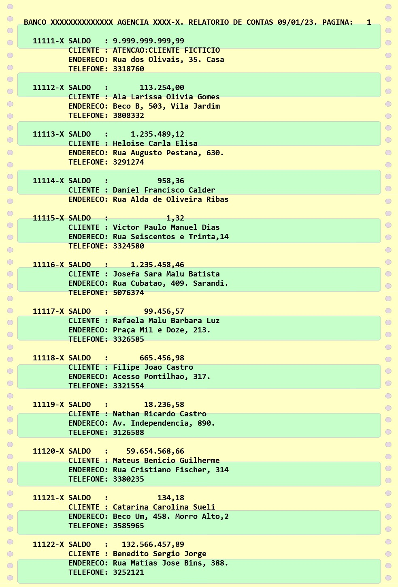
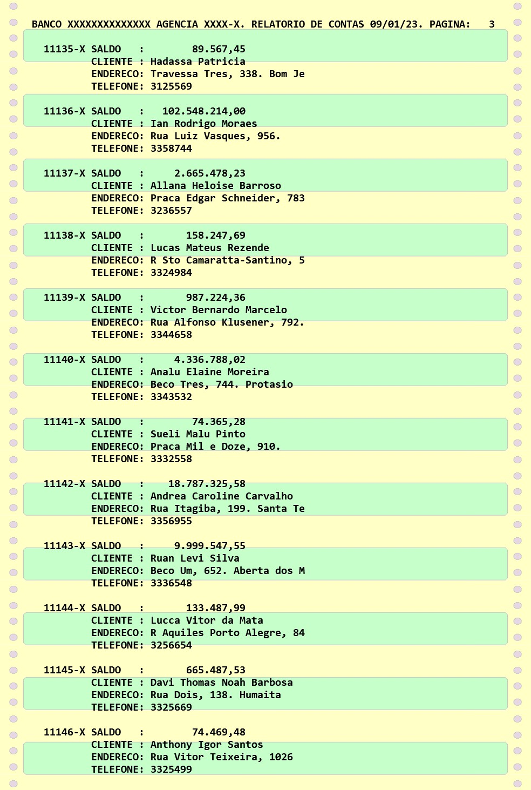
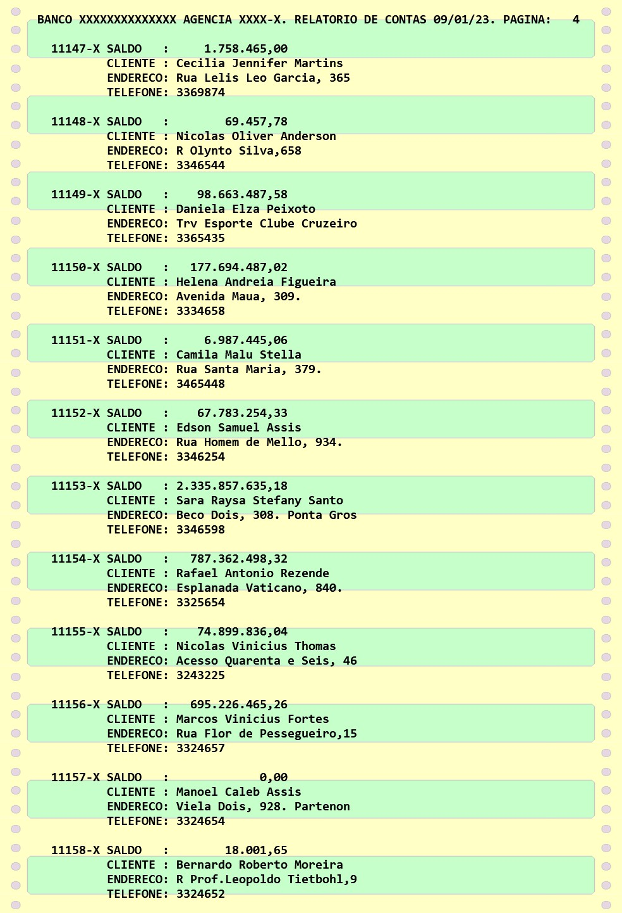

> **Warning**
> 
> [DEPRECATED]  
> Os arquivos estão mantidos neste repositório apenas para fins de demonstração e documentação. 

# Sobre o Modelo de Relatório RPG-II:

Este esqueleto de programa em RPG-II foi utilizado como modelo para a geração de relatório de agências bancárias nos anos 90.  
Utilizando um data set gerado pelo mainframe, em formato padronizado, permitia a adaptação dos relatórios aos diferentes banco e agências.  
O objetivo era implementar rapidamente relatórios de contas nas agências bancárias.  
Cabe ressaltar que, naquela época, não existia a Internet como conhecemos atualmente, e a conferência dos saldos nas contas era realizado "em papel", e a sua utilização era de fundamental importância na rotina dos escriturários.

**Desenvolvimento do Projeto:** Fermyno Gutierrez  

# Resumo da Análise de Requisitos (RFP)

## Requisitos Funcionais:

O relatório deve permitir:

- Consulta de contas bancárias com número da conta, nome do cliente, endereço, telefone, e saldo;
- Paginação automática;
- Impressão em 80 colunas;
- Impressão de banco, agência e data no cabeçalho.

## Requisitos Não-funcionais:

- O programa deve ser acessado através dos terminais "burros" existentes nas agências,
- O programa deve ser executado em ambiente mainframe,
- O programa deve utilizar a linguagem RPGII, visto que pode ser executado rapidamente através da submissão de um JCL.

# Programa:

* **Programa:** [RELCONTA.JCL](jcl/RELCONTA.JCL)  
  **Exemplo de data set:** [BANCO80.TXT](data-set/BANCO80.TXT)  
    
  **Fontes consultadas:**  
    - (1971) INTRODUCTION TO RPG II SYSTEMS
      IBM GC21-7514-1
    - (1973) BUSINESS SYSTEMS WITH PUNCHED CARD DATA PROCESSIND AND
      SYSTEM/3 MODEL 10
      F. R. CRAWFORD ISBN: 0-13-107698-1
    - (1976) IBM SYSTEM/3 RPG II REFERENCE MANUAL
      IBM SC21-7504-6 FILE NO. S3-28 PROGRAM PRODUCT
    - (1978) DOS/VS RPG II AUTO REPORT
      IBM SC33-6034-1 FILE NO. S370-28 PROGRAM NUMBER 5746-RG1
    - (1979) RPG II PROGRAMMER'S GUIDE PDR3031
      PRIME COMPUTER, INC
    - (1982) IBM SYSTEM/34 RPG II REFERENCE MANUAL
      SC21-7667-4 FILE NO. S34-28 PROGRAM NUMBER 5726-RG1
      
# Capturas de Tela:

 

 

 

       
